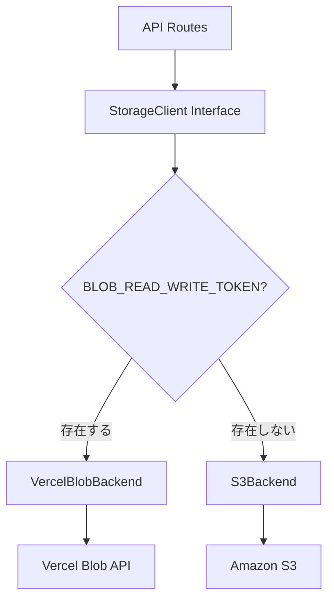

# 設計ドキュメント: Vercel Blob Storage

## 概要

本設計は、既存の Amazon S3 ベースの画像ストレージに加え、Vercel Blob をストレージバックエンドとして追加するためのアーキテクチャを定義する。ストレージ抽象化レイヤー（Strategy パターン）を導入し、環境変数 `BLOB_READ_WRITE_TOKEN` の存在有無でバックエンドを自動判定する。

### 現状分析

現在のコードベースでは、以下のファイルで S3 に直接依存している:

- `app/lib/s3client.ts` — S3Client インスタンスの生成
- `app/api/users/route.ts` — `PutObjectCommand`/`DeleteObjectCommand` による画像アップロード・削除
- `app/api/image/[key]/route.ts` — `GetObjectCommand` による画像取得

これらの S3 依存を抽象化レイヤーの背後に隠蔽し、Vercel Blob 実装を追加する。

### 設計方針

- Strategy パターンによるストレージバックエンドの切り替え
- 既存 API ルートの外部インターフェースは変更しない
- `@vercel/blob` パッケージを新規依存として追加
- モジュールレベルのシングルトンでストレージクライアントを提供

## アーキテクチャ



### ファイル構成

```
app/lib/
├── storage/
│   ├── index.ts          # StorageClient インターフェース定義 + ファクトリ関数
│   ├── s3-backend.ts     # S3 実装
│   └── vercel-blob-backend.ts  # Vercel Blob 実装
├── s3client.ts           # 既存（S3Backend から参照）
└── constant.ts           # 既存
```

### コンポーネント間の依存関係

```mermaid
graph LR
    A[app/api/users/route.ts] --> B[storage/index.ts]
    C[app/api/image/key/route.ts] --> B
    B --> D[storage/s3-backend.ts]
    B --> E[storage/vercel-blob-backend.ts]
    D --> F[app/lib/s3client.ts]
    E --> G[@vercel/blob]
```

## コンポーネントとインターフェース

### StorageClient インターフェース

```typescript
// app/lib/storage/index.ts

export interface UploadParams {
  key: string
  body: Buffer
  contentType: string
}

export interface GetResult {
  body: ReadableStream | Buffer
  contentType: string
}

export interface StorageClient {
  upload(params: UploadParams): Promise<{ url: string }>
  get(key: string): Promise<GetResult>
  delete(key: string): Promise<void>
}
```

### ファクトリ関数（プロバイダー判定）

```typescript
// app/lib/storage/index.ts

import { S3Backend } from "./s3-backend"
import { VercelBlobBackend } from "./vercel-blob-backend"

function createStorageClient(): StorageClient {
  const token = process.env.BLOB_READ_WRITE_TOKEN
  if (token && token.trim() !== "") {
    return new VercelBlobBackend()
  }
  return new S3Backend()
}

export const storageClient: StorageClient = createStorageClient()
```

### S3Backend

```typescript
// app/lib/storage/s3-backend.ts

import {
  GetObjectCommand,
  PutObjectCommand,
  DeleteObjectCommand,
} from "@aws-sdk/client-s3"
import { client } from "@/app/lib/s3client"
import { TEST_BUCKET } from "@/app/lib/constant"
import type { StorageClient, UploadParams, GetResult } from "./index"

export class S3Backend implements StorageClient {
  private bucket = process.env.S3_BUCKET || TEST_BUCKET

  async upload(params: UploadParams): Promise<{ url: string }> {
    await client.send(new PutObjectCommand({
      ACL: "private",
      Bucket: this.bucket,
      Key: params.key,
      Body: params.body,
      ContentType: params.contentType,
    }))
    return { url: params.key }
  }

  async get(key: string): Promise<GetResult> {
    const response = await client.send(new GetObjectCommand({
      Bucket: this.bucket,
      Key: key,
    }))
    return {
      body: response.Body as ReadableStream,
      contentType: response.ContentType as string,
    }
  }

  async delete(key: string): Promise<void> {
    await client.send(new DeleteObjectCommand({
      Bucket: this.bucket,
      Key: key,
    }))
  }
}
```

### VercelBlobBackend

```typescript
// app/lib/storage/vercel-blob-backend.ts

import { put, del, head } from "@vercel/blob"
import type { StorageClient, UploadParams, GetResult } from "./index"

export class VercelBlobBackend implements StorageClient {
  async upload(params: UploadParams): Promise<{ url: string }> {
    const blob = await put(params.key, params.body, {
      access: "public",
      contentType: params.contentType,
      addRandomSuffix: false,
    })
    return { url: blob.url }
  }

  async get(key: string): Promise<GetResult> {
    const blobInfo = await head(key)
    const response = await fetch(blobInfo.url)
    return {
      body: response.body as ReadableStream,
      contentType: blobInfo.contentType,
    }
  }

  async delete(key: string): Promise<void> {
    try {
      await del(key)
    } catch {
      // 存在しない場合もエラーを発生させない
    }
  }
}
```

### API ルートの変更

既存の API ルートは `storageClient` を使用するように変更する。外部インターフェース（リクエスト/レスポンス形式）は変更しない。

**app/api/users/route.ts の変更:**
- `@aws-sdk/client-s3` の直接インポートを削除
- `storageClient` を使用して `upload` / `delete` を呼び出す

**app/api/image/[key]/route.ts の変更:**
- `@aws-sdk/client-s3` の直接インポートを削除
- `storageClient.get()` を使用して画像を取得


## データモデル

### StorageClient 関連の型定義

| 型名 | フィールド | 型 | 説明 |
|------|-----------|-----|------|
| `UploadParams` | `key` | `string` | ストレージ上のオブジェクトキー |
| | `body` | `Buffer` | ファイルのバイナリデータ |
| | `contentType` | `string` | MIME タイプ（例: `image/png`） |
| `GetResult` | `body` | `ReadableStream \| Buffer` | 画像データ |
| | `contentType` | `string` | MIME タイプ |
| `StorageClient` | `upload()` | `(params: UploadParams) => Promise<{ url: string }>` | 画像アップロード |
| | `get()` | `(key: string) => Promise<GetResult>` | 画像取得 |
| | `delete()` | `(key: string) => Promise<void>` | 画像削除 |

### Vercel Blob 固有の考慮事項

- Vercel Blob はキーベースではなく URL ベースでオブジェクトを管理する
- `head()` API でキーからメタデータ（URL 含む）を取得し、その URL で `fetch` する
- `put()` に `addRandomSuffix: false` を指定してキー名を維持する
- `del()` は URL ベースで削除を行う
- 認証は `BLOB_READ_WRITE_TOKEN` 環境変数を `@vercel/blob` が自動的に読み取る

### 既存データモデルへの影響

既存の `handicap` テーブルの `image` カラム（キー名を格納）はそのまま使用する。Vercel Blob 環境では、このキー名を使って `head()` でメタデータを取得する。


## 正確性プロパティ

*プロパティとは、システムのすべての有効な実行において真であるべき特性や振る舞いのことである。プロパティは、人間が読める仕様と機械的に検証可能な正確性保証の橋渡しとなる。*

### Property 1: 非空トークンは VercelBlobBackend を選択する

*任意の* 非空かつ空白のみでない文字列をトークンとして設定した場合、ファクトリ関数は VercelBlobBackend インスタンスを返す。

**Validates: Requirements 1.1**

### Property 2: アップロード→取得ラウンドトリップ

*任意の* バイナリデータ、コンテンツタイプ、キー名の組み合わせに対して、StorageClient でアップロードした後に同じキーで取得すると、元のコンテンツタイプと同一のデータが返される。

**Validates: Requirements 3.1, 3.2, 3.4, 4.1, 4.2**

### Property 3: アップロード→削除→取得不可

*任意の* バイナリデータとキー名に対して、StorageClient でアップロードした後に削除し、再度取得を試みるとエラーとなる。

**Validates: Requirements 5.1**

### Property 4: DB 挿入失敗時のロールバック

*任意の* ストレージバックエンドにおいて、画像アップロード成功後に DB 挿入が失敗した場合、storageClient.delete が呼び出される。

**Validates: Requirements 6.4**

## エラーハンドリング

### ストレージ操作のエラー

| エラー状況 | 対応 |
|-----------|------|
| Vercel Blob アップロード失敗 | エラーを上位に伝播し、API が 500 レスポンスを返す |
| Vercel Blob 取得時にキーが存在しない | `head()` が `BlobNotFoundError` をスローするため、API が 404 相当のレスポンスを返す |
| Vercel Blob 削除時にキーが存在しない | エラーを握りつぶし、正常完了として扱う（要件 5.2） |
| S3 操作失敗 | 既存の挙動を維持（エラーが上位に伝播） |
| `BLOB_READ_WRITE_TOKEN` が無効 | `@vercel/blob` が認証エラーをスロー、API が 500 レスポンスを返す |

### API ルートのエラーハンドリング方針

- `app/api/users/route.ts`: アップロード失敗時は即座にエラーレスポンスを返す。DB 挿入失敗時は `storageClient.delete()` でロールバックを実行する
- `app/api/image/[key]/route.ts`: 取得失敗時はエラーレスポンスを返す

## テスト戦略

### テストフレームワーク

- ユニットテスト: Bun の組み込みテストランナー（`bun test`）
- プロパティベーステスト: `fast-check` ライブラリ
- E2E テスト: Playwright（既存）

### ユニットテスト

- ファクトリ関数のプロバイダー判定ロジック（環境変数の各パターン）
- S3Backend の各メソッドが正しい AWS SDK コマンドを発行すること（モック使用）
- VercelBlobBackend の各メソッドが正しい `@vercel/blob` API を呼び出すこと（モック使用）
- 存在しないキーの削除がエラーにならないこと（エッジケース）
- 存在しないキーの取得がエラーを返すこと（エッジケース）
- API ルートの外部インターフェースが変更されていないこと

### プロパティベーステスト

- 各テストは最低 100 回のイテレーションで実行する
- 各テストはコメントで設計ドキュメントのプロパティを参照する
- タグ形式: **Feature: vercel-blob-storage, Property {number}: {property_text}**
- 各正確性プロパティは1つのプロパティベーステストで実装する
- `fast-check` を使用してランダムなバイナリデータ、キー名、コンテンツタイプを生成する
- 外部サービス依存はモックで置き換え、ロジックの正確性を検証する

### テスト対象のプロパティ一覧

| プロパティ | テスト内容 | 生成するデータ |
|-----------|-----------|--------------|
| Property 1 | 非空トークン → VercelBlobBackend | ランダムな非空文字列 |
| Property 2 | upload → get ラウンドトリップ | ランダムなバイナリデータ、コンテンツタイプ、キー名 |
| Property 3 | upload → delete → get 失敗 | ランダムなバイナリデータ、キー名 |
| Property 4 | DB 失敗時のロールバック | ランダムなフォームデータ |

